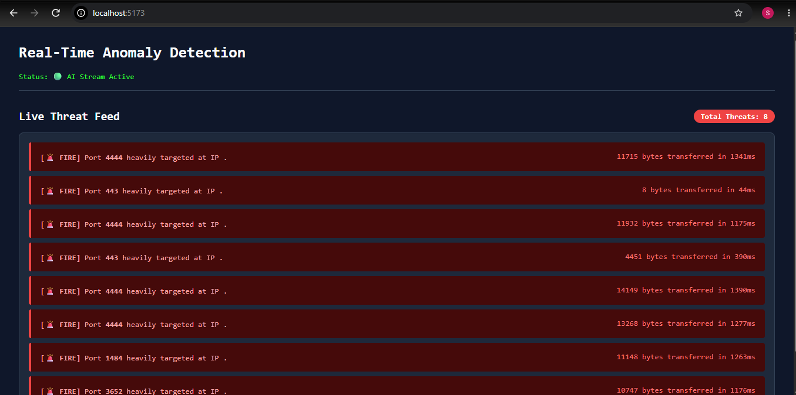
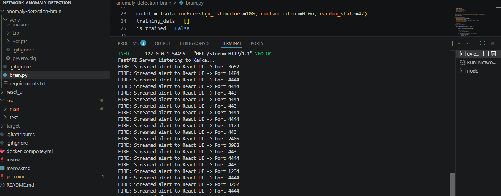

# Real-Time Network Anomaly Detection System

A distributed, security event pipeline designed to ingest, buffer, process, and classify high-throughput network traffic logs in real-time using streaming architecture and unsupervised machine learning.

---

## 🏗️ System Architecture & Data Flow

### 📊 System Architecture Diagram 


The application operates as an event-driven distributed pipeline across four decoupled layers:
1. **Traffic Generator (Spring Boot / Java 17):** Acts as the event producer, simulating high-throughput corporate network telemetry. It injects structured network access logs alongside weighted anomalies (e.g., specific target IPs, unauthorized ports, payload bytes, and session durations).
2. **Message Broker (Apache Kafka / Docker):** Operates as a fault-tolerant, highly available distributed event log that ingests raw telemetry streams from the Java service into targeted partitions.
3. **AI Inference Core (Python / FastAPI / Scikit-Learn):** A streaming analytics engine that ingests the Kafka event stream, scales telemetry data, runs unsupervised anomaly detection on the fly, and exposes an asynchronous Server-Sent Events (SSE) streaming API.
4. **Operations Dashboard (React 18 / Vite):** A real-time Security Operations Center (SOC) user interface that hooks into the AI core's SSE stream to render dynamic threat logs with zero-polling latency.

---

## 🎛️ Data Pipeline Contracts & ML Architecture

### 🛡️ Network Log Schema (Kafka Event Payload)
Events are streamed as lightweight, high-velocity JSON payloads containing core network Layer 4 metadata:
```json
{
  "timestamp": 1718445600,
  "sourceIp": "192.168.1.45",
  "targetIp": "10.0.0.99",
  "port": 4444,
  "bytesSent": 12450,
  "durationMs": 245
}
```
### 🧠 Machine Learning Engine: Isolation Forest
Rather than relying on brittle, hardcoded rules or signature matching, the system utilizes an unsupervised Isolation Forest model to detect zero-day anomalies:

* **Mathematical Core:** The algorithm isolates anomalies instead of profiling normal data points by building random decision trees. Because anomalies are "few and different," their path length to the root of a tree is significantly shorter than normal traffic, allowing quick isolation.
* **Algorithmic Efficiency:** Operates with a computational complexity of $O(n \log n)$, making it highly efficient for streaming architectures compared to heavy deep learning autoencoders.
* **React Rule-Based Heuristic Engine:** While the Isolation Forest flags mathematical anomalies (returning a generic `-1` outlier score), the React frontend runs incoming alert payloads through a declarative heuristic matrix to dynamically map metadata to specific threat profiles (e.g., mapping `Port 4444` to **Malicious Port Scan** and high `bytesSent` to **Data Exfiltration Attempt**).

---

## 🚀 Key Technical Decisions

**Why Kafka Over Direct REST POST?**  
Decouples the fast Spring Boot event producer from the heavy Python ML consumer. During high-velocity network bursts, Kafka acts as an durable data buffer, preventing the Python process from suffering memory exhaustion or thread blocking.

**Why SSE Over WebSockets?**  
Security monitoring centers require unidirectional, real-time data flow (Server $\rightarrow$ Client). Server-Sent Events (SSE) utilize native browser handling over standard HTTP protocols with built-in automatic reconnection loops, bypassing the heavy bidirectional state management overhead of WebSockets.

## 🛠️ Tech Stack

* **Core Languages:** Java 17, Python 3.10+, JavaScript (ES6+)
* **Backend Systems:** Spring Boot 3.x, Spring Scheduling, Apache Kafka, Docker, Docker Compose
* **AI/ML Layer:** FastAPI, Uvicorn (ASGI), Scikit-Learn, NumPy, Pandas
* **UI Layer:** React 18, Vite, Native EventSource API, Tailwind CSS / Inline UI Styles

---

## ⚙️ Local Setup & Operational Manual

### Prerequisites

* Java 17+ SDK & Maven
* Python 3.10+ & Virtualenv
* Node.js 18+ & npm
* Docker Desktop

### 1. Boot the Message Broker

Initialize the local single-node Kafka instance using the bundled orchestration manifest:

```bash
docker-compose up -d
```

### 2. Initialize the AI Inference Core

Set up the Python virtual environment, install processing libraries, and boot the ASGI web server:

```bash
cd anomaly-detection-brain
python -m venv venv

# Windows (PowerShell Execution Bypass if required)
Set-ExecutionPolicy -Scope Process -ExecutionPolicy Bypass
.\venv\Scripts\activate

# Mac / Linux
source venv/bin/activate

pip install -r requirements.txt
uvicorn brain:app --reload
```
The AI application server will listen for dashboard subscriptions at http://localhost:8000/alerts.


### 3. Initialize the Traffic Generator

Open the project root directory in your preferred IDE (e.g., IntelliJ IDEA) and compile/run the application bootstrapper:

```plaintext
Run: NetworkAnomalyDetectionApplication.java
```
The background scheduler will immediately begin simulating network access logs and pushing events to the active Kafka topic.

### 4. Deploy the Operations Dashboard
Install UI dependencies and spin up the frontend development server:

```bash
cd react_ui
npm install
npm run dev
```
Navigate to http://localhost:5173 to visualize the live, streaming security alert dashboard.

it will take few seconds to train the model first with 200 logs. you can check python server console.

### 4. Output
React Dashboard



Python FastAPI terminal



🙏  Thank you for your time. 😊
